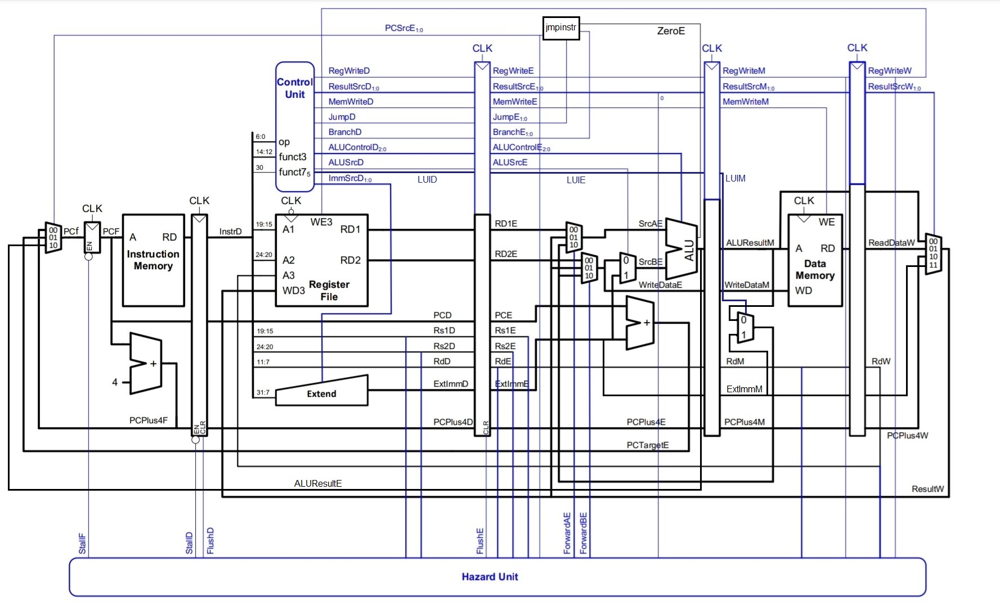

# RISC-V Processor

A 32-bit pipelined RISC-V processor implementation in Verilog, featuring a 5-stage pipeline with hazard detection and data forwarding capabilities.

## Overview

This project implements a RISC-V processor with the following features: 

- **5-Stage Pipeline Architecture**: Fetch, Decode, Execute, Memory, and Writeback stages
- **Hazard Detection Unit**: Handles data hazards and control hazards
- **Data Forwarding**: Reduces pipeline stalls through forwarding paths
- **Control Flow Instructions**: Support for jumps and branches
- **Memory Operations**: Load/Store instructions with data memory
- **RV32I Base Instruction Set**: Implementation of core RISC-V instructions

## Architecture



### Pipeline Stages

1. **Fetch (F)**: Fetches instructions from instruction memory
2. **Decode (D)**: Decodes instructions and reads from register file
3. **Execute (E)**: Performs ALU operations and calculates branch targets
4. **Memory (M)**: Accesses data memory for load/store operations
5. **Writeback (W)**: Writes results back to register file

### Key Components

- **`processor.v`**: Top-level module integrating datapath and controller
- **`datapath.v`**: Complete datapath implementation with pipeline registers
- **`controller.v`**: Control unit generating control signals for all instructions
- **`hazard_unit.v`**: Detects and resolves pipeline hazards through stalling and forwarding
- **`ALU.v`**: Arithmetic Logic Unit supporting multiple operations
- **`register_file.v`**: 32 general-purpose registers
- **`instruction_memory.v`**: Instruction memory module
- **`data_memory.v`**: Data memory for load/store operations
- **`extend. v`**: Immediate value extension unit

### Supporting Modules

- **`adder.v`**: Simple adder for PC increment and branch calculation
- **`mux2to1.v` / `mux4to1.v`**: Multiplexers for data selection
- **`register.v`**: Parameterized register module for pipeline stages
- **`jmpinstr.v`**: Jump instruction handler for control flow

## Supported Instructions

The processor supports the RV32I base instruction set including: 

- **Arithmetic**: `add`, `addi`, `sub`
- **Logical**: `and`, `or`, `xor`, `andi`, `ori`, `xori`
- **Shift**: `sll`, `srl`, `sra`
- **Comparison**: `slt`, `slti`, `sltu`, `sltiu`
- **Memory**: `lw`, `sw`
- **Branches**: `beq`, `bne`, `blt`, `bge`, `bltu`, `bgeu`
- **Jumps**: `jal`, `jalr`
- **Upper Immediate**: `lui`, `auipc`

## Files Structure

```
.
├── processor.v           # Top-level processor module
├── datapath.v           # Datapath implementation
├── controller. v         # Control unit
├── hazard_unit.v        # Hazard detection and forwarding
├── ALU.v                # Arithmetic Logic Unit
├── register_file.v      # Register file (32 registers)
├── instruction_memory.v # Instruction memory
├── data_memory.v        # Data memory
├── extend.v             # Immediate extension
├── jmpinstr.v          # Jump/branch logic
├── adder.v             # Simple adder
├── mux2to1.v           # 2-to-1 multiplexer
├── mux4to1.v           # 4-to-1 multiplexer
├── register.v          # Pipeline register
├── processor_tb.v      # Testbench
├── assembly.s          # Example assembly program
├── instructions.txt    # Machine code instructions
├── data. txt           # Data memory initialization
└── CA#04. pdf          # Project documentation
```

## Example Program

The repository includes an example assembly program (`assembly.s`) that finds the largest element in an array:

```assembly
        add x6, x0, x0
        addi x8, x0, 0
        addi x10, x0, 0
        addi x11, x0, 0

LOOP:    slti x7, x6, 80
        beq x7, x0, END_LOOP

        lw x9, 0(x6)

        slt x1, x8, x9
        beq x1, x0, SKIP
        add x8, x0, x9
        add x11, x0, x10

SKIP:    addi x6, x6, 4
        addi x10, x10, 1
        j LOOP

END_LOOP:

# x8  = largest element
# x11 = index of that element (0..19)
```

This program: 
- Iterates through 20 elements (80 bytes / 4 bytes per word)
- Finds the maximum value and its index
- Demonstrates load, branch, jump, and arithmetic instructions

## Simulation

### Running the Testbench

The processor includes a testbench (`processor_tb.v`) for simulation:

```bash
# Using Icarus Verilog
iverilog -o processor_sim processor_tb.v processor.v datapath.v controller. v hazard_unit.v ALU.v register_file.v instruction_memory.v data_memory.v extend.v jmpinstr.v adder.v mux2to1.v mux4to1.v register.v

# Run simulation
vvp processor_sim

# View waveforms (if using GTKWave)
gtkwave processor. vcd
```

### Memory Initialization

- **`instructions.txt`**: Contains the machine code to be loaded into instruction memory
- **`data.txt`**: Contains initial data values for data memory

## Hazard Handling

### Data Hazards

The processor handles data hazards through: 

1. **Data Forwarding**: Bypasses data from later pipeline stages to earlier stages
   - EX/MEM → EX stage
   - MEM/WB → EX stage

2. **Pipeline Stalls**: Inserts bubbles when forwarding cannot resolve the hazard
   - Load-use hazards require a 1-cycle stall

### Control Hazards

Control hazards from branches and jumps are handled by: 
- **Branch prediction**: Assumes branches are not taken
- **Pipeline flushing**: Flushes incorrect instructions when branch is taken
- **Early branch resolution**: Branch condition evaluated in Execute stage

## Design Considerations

- **Clock Edge**:  Register file writes on negative edge, reads on positive edge to avoid timing issues
- **Reset**: Synchronous reset for all pipeline registers
- **Parameterized Modules**: Pipeline registers use parameterized widths for flexibility
- **Zero Register**: Register x0 hardwired to zero (implemented in register file)

## Future Enhancements

Potential improvements for this processor:

- [ ] Add support for M extension (multiplication/division)
- [ ] Implement compressed instructions (C extension)
- [ ] Add cache memory hierarchy
- [ ] Implement exception handling
- [ ] Add branch prediction unit
- [ ] Support for interrupts
- [ ] Memory-mapped I/O

## Documentation

For more detailed information about the implementation, refer to `CA#04.pdf` included in the repository.

**Note**: This is an educational implementation of a RISC-V processor and is intended for learning purposes. 